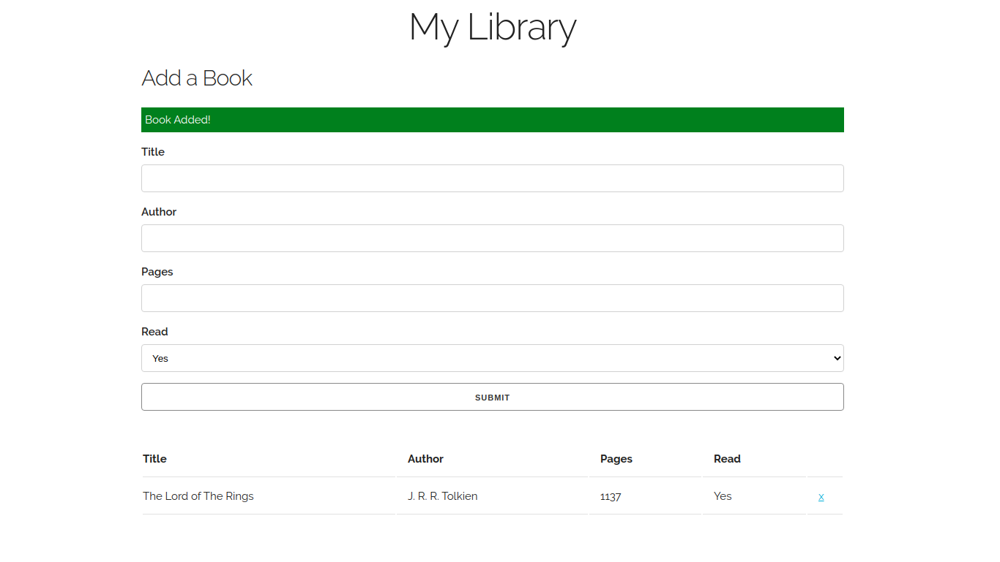

# A Minimal Styled Booklist With Local Storage

Live Site: https://kchhan.github.io/my-library/

---

## Tools Used:

- HTML5
- CSS3
  - Skeleton CSS Boilerplate
- JavaScript

---

## My Learning Outcomes:

- [x] Create and delete data dynamically
- [x] Utilize Local Storage for persisting data
- [x] Convert JSON data to JavaScript objects and vice versa

---

This project is part of The Odin Project curriculum found here:  
https://www.theodinproject.com/courses/javascript/lessons/library
